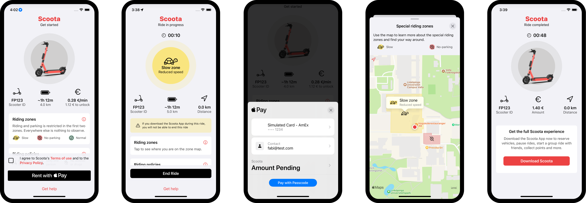

# Scoota App Clip
As part of my master's thesis "concept and development of a protoypical App Clip for a shared e-scooter rental app", the fictional App Clip Scoota was developed, which allows users to rent an e-scooter.
The App Clip was implemented with SwiftUI, and for the minimum deployment, iOS 16.2 is required.
It offers Apple Pay as a payment method integrated using the PassKit framework. In addition, an important feature is zone monitoring, with which users are constantly notified of the zone in which they are located. This functionality is implemented using the Core Location and MapKit frameworks.

## Run App Clip on Simulator
To best showcase the functionality of the App Clip on the simulator, the subsequent procedure should be followed:
1. Clone repository
2. Open `Scoota.xcodeproj` in Xcode
3. Choose the App Clip target and press `Edit Scheme...`
4. In `Run > Arguments`run arguments enter `_XCAppClipURL` as name and  `https://example.com?id=ES123` as value to create a new environment variable
5. In `Run > Options` choose `SlowZone` as the default location and make sure the box for `Allow Location Simulation` is checked
After this, the App Clip can be run. Make sure to run the App Clip on a simulator device at least the size of an iPhone 14, as the design was adapted to this minimum size. Using the environment variable, the URL is simulated, corresponding to the scooter's visual code and containing the scooter ID. By selecting the default location, the simulator is directly located in an area where zones are drawn. While the App Clip is running, the location can be changed. For this purpose, the three custom locations `Slowzone`, `NoParkZone` and `NormalZone` are stored in the Xcode project, making it possible to simulate the different zones. Simulating a location change in Xcode is done by clicking on the navigation arrow above the console or in the simulator by clicking on `Features > Location`. Since the distance logic is simulated and only changes when the actual location data is accessed, it remains unchanged in the simulator.

## Run App Clip on device
Testing the App Clip on a real device is more difficult for several reasons:
1. The implementation requires the App Clip and Apple Pay capabilities, which are only part of the paid Apple Developer Program.
2. The zone logic is mocked, and the coordinates for where zones are located are hard coded. So in the location where testing is to be done, zones must first be entered to try out the full functionality of the App Clip.
3. For Apple Pay to work, several configurations must be done outside of Xcode, like creating a merchant ID, sandbox tester, and payment processing certificate (more information ca be found in [Apple's documentation](https://developer.apple.com/documentation/passkit/apple_pay/setting_up_apple_pay)).

Since testing the App Clip with the simulator is sufficient for showcasing,  there are no further instructions on how to run the App Clip on a real device.

## Preview[^1]
 

    Screenshots of Scoota App Clip

 

[^1]: Source of scooter image: http://docs.voi.com/assets/
